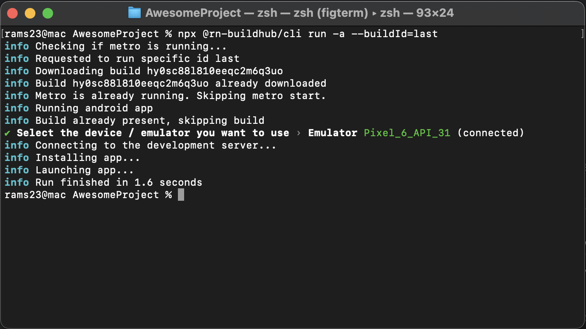

# React Native Build Hub: Supercharge Your Development! 🚀

Welcome to **React Native Build Hub**, the tool that turns the agonizing wait of native builds into a thing of
the past. By focusing on JS-centric development stages, we ensure you spend less time waiting and more time creating!

Expo is great, but it comes with some limitations. React Native Build Hub tries to give you the same developer experience
of an Expo project, without compromises on native stuffs.

The native build step is notoriously the slowest segment of the build procedure, often dragging on for a
tiresome 5-10 minutes (or more) and where most of
the errors show off, wasting hours of your time. However, a majority of the time, when you are tweaking the JavaScript
code only, a native build is not necessary. Once your app reaches a mature stage, JavaScript alterations become the
norm, making native builds infrequent (you need them only to update the native deps or to add a new one). React Native
Build Hub shines
in such scenarios, stepping in to cache the native build, thereby saving you an enormous amount of time.

Table of contents
=================

<!--ts-->

* [How it works](#how-it-works)
* [Disclaimer](#disclaimer)
* [Credits](#credits)
* [Requirements](#requirements)
* [Installation](#installation)
* [Usage](#usage)
* [Remotes](#remotes)
* [Supported features and platforms](#supported-features-and-platforms)
* [Who we are](#who-we-are)

<!--te-->

🛠How it works
============
The tool smartly caches the native builds remotely (using a configurable storage, see [Remotes](#remotes)) after crafting them like the react-native official cli does.
Your team members can then use the cached build to run the app on their machines in a matter of seconds. The cli tool
also handles the metro bundler, so you don't have to start it, as well as the
emulator. It also supports multiple flavors/schemas.

You can always choose to force a native build when running the app. In the future, the cli tool may
add some heuristics to decide when to force the native build.

<p align="center">

</p>

⚠️ Disclaimer
============

There are many configurations for native builds, and it's possible that this CLI does not support your
specific one. If you encounter any problem, please feel free to file an issue or submit a pull request.

🎖Credits
============

This project is highly inspired by the [React Native architecture articles by
Wix](https://medium.com/wix-engineering/react-native-at-wix-the-architecture-ii-deep-dive-9cfcb3c2822c) and the [related
repo](https://github.com/wix-incubator/react-native-wix-engine).

Requirements
============

For more detailed information on setting up your development environment for Android and iOS, refer to the
official [React Native documentation](https://reactnative.dev/docs/environment-setup).

### Android

- Java Development Kit
- Android Studio
- Android SDK
- Environment variables
    - JAVA_HOME
    - ANDROID_HOME
    - ANDROID_SDK_ROOT

### iOS

- A macOS machine with Xcode.
- CocoaPods.
- Xcode command line tools

Installation
============

### The cli

```bash
npm install --save-dev @rn-buildhub/cli
```

🎮 Usage
============

### Init

The init command will ask you which remote you want to use and let you know which package you have to install.
Each remote has its own package because we care about you node_modules black hole.

```bash
npx @rn-buildhub/cli init
```

This will create a `.rn-buildhub.json` config and add `.rn-buildhub` (the cache folder) to the gitignore.

### Run

The run command launches the app on the emulator. It will first check if the native build is present in the
cache folder. If it is, it will use it. If it is not, it will build it and then run the app.

The target device can be selected directly from the command line.

The cli handles also metro bundler. If it is not running, it will start it.

You can also directly run a remote build using the buildId or the special name "last", to download and
immediately run your native app. The stored build can contain both android and ios builds for all the schemas/flavors.

```bash
npx @rn-buildhub/cli run [-a|-i] [-f|--flavor flavor] [--force-build] [--buildId=buildId] [--force-build]
```

#### Options

- `-i/--ios`: run on iOS
- `-a/--android`: run on Android
- `-f/--flavor`: specify the flavor/schema
- `--id/--buildId`: The build id stored in the remote storage to run
- `--fb/--force-build`: force a native build ignoring the cache
- `--ios-platform`: specify "device" or "simulator", default to "simulator"

### Build

The build command builds the app for the specified platform. It's an explicit build, so it will
override the local cache folder for the specified platform and flavor/scheme.

The build output will be stored in the cache folder `.rn-buildhub`.

```bash
@rn-buildhub/cli build [-i/--ios] [-a/--android] [-f/--flavor]
```

#### Options

- `-i/--ios`: build for iOS
- `-a/--android`: build for Android
- `-f/--flavor`: specify the flavor/schema
- `--ios-platform`: specify "device" or "simulator", default to "simulator"

### Upload Build

The build upload is the required step to share the builds with your team. This command will search for all the builds
in the cache folder zip them and save on the remote storage, keeping track of the platform, flavor, target device etc.

See [Suggested Workflow](#Suggested worflow)

```bash
@rn-buildhub/cli build:upload
```

### Download Build

To explicitly download a build from the remote storage and store it locally. It is not required to run a specific remote
build,
you can directly use the run command.

```bash
@rn-buildhub/cli build:download --buildId=buildId
```

### Replace local cache

To replace your local cache with the content of a build id you can use this command. It will make the build id your
default, so any run (also without the build id) will search for the native build in the given id. Pay attention,
this command overrides your local cache, so be aware.

```bash
@rn-buildhub/cli build:current --buildId=buildId
```

Remotes
============

The remote storage is where the builds are saved, the cli supports different adapters that are published in separate
packages. There is also a storage interface that you can use to create your own adapter. The cli will dynamically
import the default export of the package indicated in the .rn-buildhub.json remote name and assume it's an
implementation
of the `@rn-buildhub/storage-interface`(See [Storage interface](./packages/storage-interface/README.md))

React Native Build Hub ships adapter for AWS S3, Azure Blob Storage and GCP Bucket.
To configure your own bucket and the required env vars take a look at the readmes

* [Amazon Web Services](./packages/storage-s3/README.md)
* [Azure](./packages/storage-azure/README.md)
* [Google Cloud Platform](./packages/storage-gcp/README.md)

Supported features and platforms
============

The cli supports macOS for now. Windows support is coming soon for android.

✅ - Supported, 🚧 - In progress, ❌ - Not supported

| Feature                             | Android | iOS |
|-------------------------------------|:-------:|:---:|
| Run on emulator                     |    ✅    |  ✅  |
| Run on device                       |   🚧    | 🚧  |
| Debug build                         |    ✅    |  ✅  |
| Build flavor/schema                 |    ✅    |  ✅  |
| Release build                       |   🚧    | 🚧  |
| Incremental build                   |   🚧    | 🚧  |
| Resign of incremental build         |   🚧    | 🚧  |
| Re-versioning of incremental builds |   🚧    | 🚧  |

Who we are
============


A proudly 🇮🇹 software development and data science startup.<br>We consider ourselves a family of talented and passionate people building their own products and powerful solutions for our clients. Get to know us more on <a target="_blank" href="https://xtreamers.io">xtreamers.io</a> or follow us on <a target="_blank" href="https://it.linkedin.com/company/xtream-srl">LinkedIn</a>.
